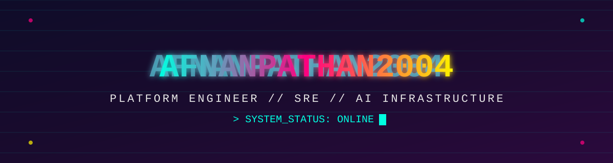
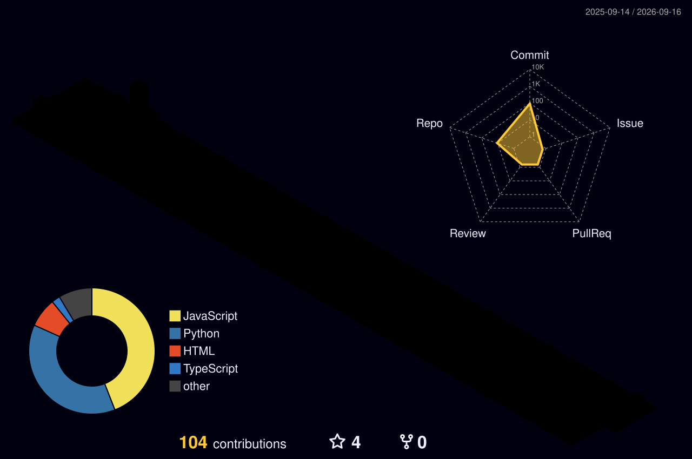

## 🕹️ PLAYER HUD

  

## 🔥 COMBO STREAK

## 🏆 BOSS TROPHIES

## ⚙️ WEAPON LOADOUT

## 📡 FULL SYSTEM SCAN

⚡ full stats dossier — calendar heatmap, achievements, languages, activity — auto-generated daily

## 🧊 3D CONTRIBUTION MAP

⚡ rendered from real commit history — auto-generated daily

## 🐍 THE SNAKE THAT EATS YOUR COMMITS

## ⚡ ACTIVITY LOG

